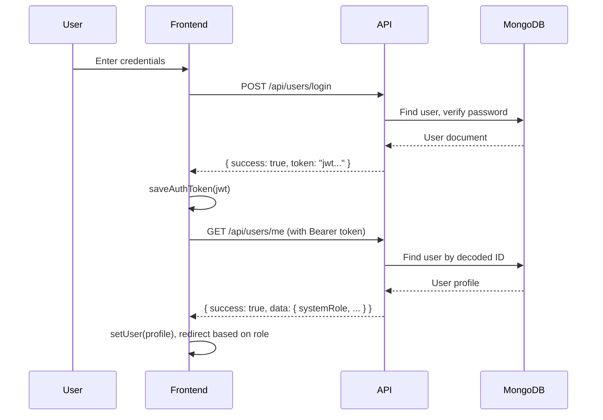

# Hackathon Platform — Comprehensive Codebase Report

> A full-stack hackathon management platform built with **Express 5 + Mongoose 9** (backend) and **React + Vite** (frontend). It supports multi-role users (admin, judge, participant), team formation, project submissions, criteria-based evaluations, and a public calendar.

---

## Project Structure Overview

```
Hackathon_Project_2025-26/
├── index.js                  ← Server entry point
├── package.json              ← Backend dependencies
├── .env                      ← Environment variables
├── src/
│   ├── app.js                ← Express app setup (CORS, routes, middleware)
│   ├── config/               ← DB, Passport strategies
│   ├── controllers/          ← Business logic (9 files, incl. profile)
│   ├── middlewares/           ← Auth, Authorize, Error handler
│   ├── models/               ← Mongoose schemas (6 files)
│   ├── policies/             ← ABAC policy engine (21 rules)
│   ├── routes/               ← API route definitions (9 files, incl. profile)
│   ├── utils/                ← JWT, Logger, Seeders
│   └── client/               ← React frontend (Vite)
│       ├── src/
│       │   ├── main.jsx      ← React entry point
│       │   ├── App.jsx       ← Route definitions
│       │   ├── context/      ← AuthContext (global auth state)
│       │   ├── services/     ← API clients (api.js, judgeApi.js)
│       │   ├── utils/        ← Auth token utilities
│       │   ├── pages/        ← 17 page components
│       │   ├── components/   ← 38+ reusable components
│       │   ├── styles/       ← 15 CSS files
│       │   └── data/         ← Static/mock data files
│       └── vite.config.js
```

---

## Technology Stack

| Layer | Technology | Version |
|-------|-----------| --------|
| Runtime | Node.js | — |
| Framework | Express | 5.2.1 |
| Database | MongoDB via Mongoose | 9.0.1 |
| Auth | JWT (jsonwebtoken) | 9.0.3 |
| Password | bcryptjs | 3.0.3 |
| OAuth | Passport (Google, GitHub) | 0.7.0 |
| Rate Limiting | express-rate-limit | 8.2.1 |
| Frontend | React + Vite | — |
| HTTP Client | Axios | — |
| Routing | react-router-dom | — |

---

# BACKEND

## Entry Point & App Setup

### `index.js`
Server entry point. Loads `.env`, connects to MongoDB via `connectDB()`, and starts Express on `PORT` (default 8080).

### `src/app.js`
Express application configuration:
- **CORS**: Allows `http://localhost:5173` (Vite dev server), credentials enabled
- **Rate Limiter**: 5 requests/second (currently disabled)
- **Middleware**: JSON parser, Passport initialization, request logger
- **Route Mounts**: 9 route groups under `/api` (users, teams, hackathons, calendar, submissions, evaluations, admin, profile, oauth)
- **Health Check**: `GET /test` returns `{ success: true }`
- **Error Handler**: Global error middleware

---

## Config (`src/config/`)

| File | Purpose |
|------|---------|
| `db.js` | MongoDB connection via `MONGO_URI` env variable (fallback: `localhost:27017/hackathon_db`) |
| `google.passport.js` | Google OAuth2 strategy — finds or creates user with `authProvider: 'google'` |
| `github.passport.js` | GitHub OAuth strategy — finds or creates user with `authProvider: 'github'` |

---

## Models (`src/models/`)

### User (`user.model.js`)
Central user model. Key fields:

| Field | Type | Description |
|-------|------|-------------|
| `fullName` | String | Required, trimmed |
| `email` | String | Required, unique, indexed |
| `password` | String | Hashed (bcrypt), `select: false` — never returned by default |
| `systemRole` | Enum | `user` / `admin` / `mentor` — platform-wide role |
| `hackathonRoles[]` | Array | Per-hackathon roles: `participant` / `judge` / `organizer` |
| `authProvider` | Enum | `local` / `google` / `github` |
| `googleId` / `githubId` | String | OAuth provider IDs (sparse unique) |
| `college`, `department`, `year` | Mixed | Student profile info |
| `skills[]` | String[] | User's listed skills |
| `github`, `linkedin` | String | Social links |
| `teams[]` | ObjectId[] | References to Team documents |

### Hackathon (`hackathon.model.js`)
Hackathon event with lifecycle dates. Key fields:

| Field | Type | Description |
|-------|------|-------------|
| `title`, `description` | String | Hackathon metadata |
| `startDate`, `endDate` | Date | Event timeline |
| `registrationDeadline`, `prototypeDeadline`, `finalDeadline` | Date | Key deadline dates |
| `presentationDate`, `resultDate` | Date | Judging timeline |
| `status` | Enum | `draft` → `open` → `ongoing` → `closed` |
| `judges[]` | Array | `{ judgeUserId: ObjectId, assignedAt: Date }` |
| `maxTeamSize` | Number | Maximum members per team |
| `createdBy` | ObjectId | Admin/mentor who created it |

### Team (`team.model.js`)
Team within a hackathon. Key fields:

| Field | Type | Description |
|-------|------|-------------|
| `name` | String | Required; unique per hackathon (compound index) |
| `hackathonId` | ObjectId | Belongs to this hackathon |
| `leader` | ObjectId | Team creator/leader |
| `members[]` | Array | `{ userId, status: 'pending'/'accepted' }` |
| `maxSize` | Number | Maximum team capacity |
| `isOpenToJoin` | Boolean | Whether new members can request to join |
| `isLocked` | Boolean | Locked after submission |
| `project` | Object | `{ title, description, repoUrl, demoUrl, driveUrl, submittedAt }` |
| `presentationSlot` | Object | `{ date, startTime, endTime }` |

> Has pre-save hook preventing duplicate team members. Unique compound index on `(name, hackathonId)`.

### Submission (`submission.model.js`)
Project submission for a team. Key fields:

| Field | Type | Description |
|-------|------|-------------|
| `hackathonId`, `teamId`, `submittedBy` | ObjectId | Core references |
| `projectDetails` | Object | `{ title, description, pptLink, repoLink, demoLink }` |
| `track` | String | Submission track/category |
| `round` | Enum | `Round 1` / `Round 2` / `Finals` |
| `status` | Enum | `submitted` → `under_review` → `graded` / `rejected` |
| `score` | Number | 0–100 |
| `qualified` | Boolean | Whether submission advances |

> Unique compound index on `(hackathonId, teamId, round)`.

### Evaluation (`evaluation.model.js`)
Judge's evaluation of a team. Supports criteria-based scoring:

| Criteria | Score Range | Weight |
|----------|-----------|--------|
| Innovation | 0–10 | configurable |
| Technical Implementation | 0–10 | configurable |
| Problem Relevance | 0–10 | configurable |
| Presentation | 0–10 | configurable |
| Feasibility | 0–10 | configurable |

Additional fields: `totalScore`, `normalizedScore`, `remarks`, `strengths`, `improvements`, `status` (draft/submitted/locked), `round` (round1/round2/final).

> Unique compound index on `(hackathonId, teamId, judgeId, round)` — prevents duplicate evaluations.

### CalendarEvent (`calendar.model.js`)
Static calendar events. Fields: `title`, `date`, `time`, `type` (Registration/Submission/Results/Evaluation), `status` (Upcoming/Ongoing/Past), `hackathon` (ref), `hackathonName`, `description`.

---

## Middlewares (`src/middlewares/`)

| File | Purpose |
|------|---------|
| `auth.middleware.js` | Extracts JWT from `Authorization: Bearer <token>`, verifies it, attaches `req.user` with full user document |
| `authorize.js` | **Policy-based authorization engine**. Takes an action name + context builder. Calls the matching rule from `policy.js`, returns 403 if denied. Logs detailed context for debugging. |
| `error.middleware.js` | Global error handler — logs errors with full request info, returns `{ success: false, message }` |

---

## Authorization Policies (`src/policies/policy.js`)

The `authorize` middleware delegates decisions to `policy.js`, which contains **21 policy rules** using **Attribute-Based Access Control (ABAC)**:

### User Policies
| Policy | Who Can |
|--------|---------|
| `USER_SELF_ACCESS` | User accessing their own resource |
| `VIEW_ALL_USERS` | Admin only |
| `VIEW_USER_BY_ID` | Admin only |
| `DELETE_USER` | Admin only |
| `SEARCH_USERS` | Any authenticated user |

### Team Policies
| Policy | Who Can |
|--------|---------|
| `CREATE_TEAM` | Authenticated user if hackathon is `open`, not already in a team, not a judge |
| `REQUEST_JOIN_TEAM` | Authenticated if hackathon `open`, team not locked/full, not already in a team |
| `MANAGE_TEAM_MEMBERS` | Team leader only (if team not locked) |
| `UPDATE_TEAM` | Team leader only (if team not locked) |
| `LEAVE_TEAM` | Accepted member (not leader, team not locked) |
| `DELETE_TEAM` | Team leader only (if team not locked) |
| `VIEW_TEAM_DETAILS` | Admin, leader, accepted member, organizer, or judge |

### Hackathon Policies
| Policy | Who Can |
|--------|---------|
| `CREATE_HACKATHON` | Admin or mentor |
| `UPDATE_HACKATHON` | Admin, mentor, or hackathon organizer |
| `DELETE_HACKATHON` | Admin or mentor |
| `ASSIGN_JUDGE` / `REMOVE_JUDGE` | Admin, mentor, or hackathon organizer |

### Submission Policies
| Policy | Who Can |
|--------|---------|
| `CREATE_SUBMISSION` | Team leader, hackathon `ongoing`, before deadline, no existing submission |
| `UPDATE_SUBMISSION` | Team leader, hackathon `ongoing`, before deadline |
| `VIEW_SUBMISSION` | Admin, team leader/member, or hackathon judge |

### Evaluation Policies
| Policy | Who Can |
|--------|---------|
| `CREATE_EVALUATION` | Admin or assigned judge |
| `UPDATE_EVALUATION` | Admin or evaluation owner (if not locked) |
| `LOCK_EVALUATION` | Admin or mentor |
| `VIEW_EVALUATION` | Admin, mentor, judge, organizer, team leader/member |
| `DELETE_EVALUATION` | Admin or mentor |

---

## Utils (`src/utils/`)

| File | Purpose |
|------|---------|
| `jwt.js` | `signToken(payload)` – signs JWT with `JWT_SECRET`, expires in `JWT_EXPIRES_IN` (default 7d). `verifyToken(token)` – verifies JWT. |
| `logger.js` | Colored console logging with methods: `info`, `success`, `warn`, `error`, `request`. Auto-formats objects. |
| `admin.seed.js` | Seeds an admin user if none exists |
| `seedCalendar.js` | Seeds calendar events from hackathon dates |

---

## API Endpoints (All Routes)

> Base URL: `http://localhost:8080/api`

### `/api/users` — `user.routes.js`

| Method | Endpoint | Auth | Purpose |
|--------|----------|------|---------|
| `POST` | `/register` | Public | Register new user (hashes password, returns JWT) |
| `POST` | `/login` | Public | Login with email/password (returns JWT) |
| `POST` | `/logout` | Auth | Server-side logout acknowledgment |
| `GET` | `/me` | Auth | Get current user's profile |
| `PUT` | `/me` | Auth | Update current user's profile (cannot change systemRole) |
| `GET` | `/search?q=` | Auth | Search users by name/email (max 20 results) |
| `GET` | `/` | Auth + Policy | Admin: get all users |
| `GET` | `/:id` | Auth + Policy | Admin: get user by ID |
| `DELETE` | `/:id` | Auth + Policy | Admin: delete user |

---

### `/api/hackathons` — `hackathon.routes.js`

| Method | Endpoint | Auth | Purpose |
|--------|----------|------|---------|
| `GET` | `/` | Public | Get all hackathons |
| `GET` | `/:id/teams` | Public | Get teams for a hackathon |
| `GET` | `/search` | Auth | Search hackathons by keyword |
| `GET` | `/:id` | Auth | Get hackathon by ID |
| `POST` | `/` | ⚠️ Public* | Create hackathon |
| `PATCH` | `/:id` | ⚠️ Public* | Update hackathon |
| `PATCH` | `/:id/status` | ⚠️ Public* | Update hackathon status |
| `POST` | `/:hackathonId/judges` | Auth + Policy | Assign judge to hackathon |
| `DELETE` | `/:hackathonId/judges/:judgeUserId` | Auth + Policy | Remove judge from hackathon |
| `DELETE` | `/:id` | Auth + Policy | Delete hackathon |

> ⚠️ **Security Issue**: Routes marked with `*` lack `auth` middleware — anyone can create/update hackathons. These routes need `auth` + `authorize` middleware.

---

### `/api/teams` — `team.routes.js`

| Method | Endpoint | Auth | Purpose |
|--------|----------|------|---------|
| `GET` | `/hackathon/:hackathonId/public` | Auth | Public discovery: open teams in a hackathon |
| `GET` | `/hackathon/:hackathonId/search` | Auth + Policy | Search teams (needs VIEW_TEAM_DETAILS) |
| `POST` | `/` | Auth + Policy | Create team (CREATE_TEAM policy) |
| `GET` | `/:teamId` | Auth + Policy | Get team details |
| `POST` | `/:teamId/join` | Auth + Policy | Request to join a team |
| `GET` | `/:teamId/requests` | Auth + Policy | Get pending join requests (leader only) |
| `PATCH` | `/:teamId/member` | Auth + Policy | Accept/reject member (leader only) |
| `PATCH` | `/:teamId` | Auth + Policy | Update team settings |
| `DELETE` | `/:teamId/leave` | Auth + Policy | Leave team (members, not leader) |
| `DELETE` | `/:teamId` | Auth + Policy | Delete team (leader only) |

---

### `/api/submissions` — `submission.routes.js`

| Method | Endpoint | Auth | Purpose |
|--------|----------|------|---------|
| `POST` | `/` | Auth + Policy | Create submission (leader only, syncs Team.project) |
| `PUT` | `/:submissionId` | Auth + Policy | Update submission (leader only) |
| `GET` | `/:submissionId` | Auth + Policy | View submission (leader, members, judges, admin) |

---

### `/api/evaluations` — `evaluation.routes.js`

| Method | Endpoint | Auth | Purpose |
|--------|----------|------|---------|
| `POST` | `/hackathons/:hackathonId/teams/:teamId/evaluations` | Auth + Policy | Judge creates evaluation |
| `PATCH` | `/:evaluationId` | Auth + Policy | Update evaluation (judge/admin, not locked) |
| `PATCH` | `/:evaluationId/lock` | Auth + Policy | Lock evaluation (admin/mentor) |
| `GET` | `/hackathons/:hackathonId/teams/:teamId/evaluations` | Auth + Policy | Get all evaluations for a team |
| `DELETE` | `/:evaluationId` | Auth + Policy | Delete evaluation (admin/mentor) |

---

### `/api/admin` — `admin.routes.js`

All routes require `auth` + `adminOnly` middleware (checks `systemRole === 'admin'`).

| Method | Endpoint | Purpose |
|--------|----------|---------|
| `GET` | `/dashboard` | Dashboard stats (hackathon count, teams, submissions, users) |
| `GET` | `/hackathons` | List all hackathons |
| `GET` | `/submissions` | List all submissions |
| `GET` | `/teams` | List all teams |
| `GET` | `/hackathons/:id/overview` | Hackathon overview (team/submission stats) |
| `GET` | `/judges` | List all judges |
| `POST` | `/hackathons/:hackathonId/judges` | Assign judges to hackathon |

---

### `/api/calendar` — `calendar.routes.js`

| Method | Endpoint | Auth | Purpose |
|--------|----------|------|---------|
| `GET` | `/` | Public | Get all calendar events |
| `POST` | `/` | ⚠️ Public | Create a calendar event |

> Commented-out endpoints for public calendar (auto-generated from hackathon dates) and ICS export exist in the controller but are not mounted.

---

### `/api/profile` — `profile.routes.js`

| Method | Endpoint | Auth | Purpose |
|--------|----------|------|---------|
| `GET` | `/me` | Auth | Aggregated profile (user + teams + hackathons + submissions + evaluations + stats) |

Controller: `profile.controller.js` — single endpoint that aggregates data from 5 collections.

---

### `/api/oauth` — `oauth.routes.js`

| Method | Endpoint | Purpose |
|--------|----------|---------|
| `GET` | `/google` | Initiates Google OAuth flow |
| `GET` | `/google/callback` | Google OAuth callback — returns JWT |
| `GET` | `/github` | Initiates GitHub OAuth flow |
| `GET` | `/github/callback` | GitHub OAuth callback — returns JWT |

---

# FRONTEND

## Entry Point & Routing

### `main.jsx`
React entry point. Wraps `<App>` in `<BrowserRouter>` + `<AuthProvider>` for global auth state.

### `App.jsx`
Route definitions. Three route groups:

| Group | Routes | Access |
|-------|--------|--------|
| **Public** | `/` (Home), `/login`, `/signup` | Everyone |
| **Admin-only** | `/admin/dashboard`, `/admin/hackathons/create`, `/admin/hackathons/:id`, `/admin/hackathons/:id/edit`, `/admin/hackathons/:id/dashboard` | `systemRole === 'admin'` |
| **Authenticated** | Judge routes (`/judge/*`), Participant routes (`/user/*`), User routes (`/profile`, `/discovery`, `/calendar`) | Any logged-in user |

Fallback: `/*` → redirects to `/login`.

---

## Auth System

### `AuthContext.jsx`
React Context providing global auth state. Methods:
- **`login(jwt)`** — Saves token, calls `/users/me`, sets user state
- **`logout()`** — Clears token + localStorage, redirects to `/login`
- **`hydrateUser(jwt)`** — On mount, rehydrates user from stored token via `/users/me`
- **401 Interceptor** — Auto-logout on expired token responses

Exposes: `{ user, token, loading, login, logout, isAuthenticated }`

### `ProtectedRoute.jsx`
Route guard component. Features:
- Shows loading spinner while auth hydrating
- Redirects to `/login` if unauthenticated
- Checks `user.systemRole` against `allowedRoles` prop (if provided)
- Uses `<Outlet>` for nested routes

### `authUtils.js`
Helper functions: `saveAuthToken`, `getAuthToken`, `removeAuthToken`, `isAuthenticated`, `decodeToken`, `isTokenExpired`, `getCurrentUser`.

---

## API Services

### `api.js`
Main Axios client (base URL: `http://localhost:3000/api`). Features:
- **Request interceptor**: Automatically attaches JWT `Authorization` header
- **Auth compatibility layer**: Falls back to `profile` localStorage for legacy support
- **Exports**: `signIn`, `signUp`, `getMe`, `searchUsers`, `getMyProfile`, `updateMyProfile`, `getAdminDashboard`, `getAdminHackathons`, `getAdminSubmissions`, `getAdminTeams`, `getHackathonOverview`, `createHackathon`, `updateHackathon`, `updateHackathonStatus`, `getHackathonById`, `getHackathonTeams`, `registerTeam`, `requestJoinTeam`, `getCalendarEvents`, `getAllJudges`, `assignJudgesToHackathon`, `handleApiError`

### `judgeApi.js`
Judge-specific API wrapper with error handling. Methods: `getAssignedHackathons`, `getHackathonById`, `getHackathonOverview`, `getTeamsByHackathon`, `getTeamDetails`, `getSubmission`, `createEvaluation`, `updateEvaluation`, `getEvaluationsByTeam`, `lockEvaluation`, `deleteEvaluation`, `getMe`.

---

## Pages (17 total)

### Public Pages

| Page | Path | File | Purpose |
|------|------|------|---------|
| Home | `/` | `pages/home/Home.jsx` | Landing page with hero, feature highlights, stats, CTA |
| Login | `/login` | `pages/auth/Login.jsx` | Email/password login form, Google/GitHub OAuth buttons |
| Signup | `/signup` | `pages/auth/Signup.jsx` | Registration form with validation |

### Admin Pages (require `systemRole: 'admin'`)

| Page | Path | File | Purpose |
|------|------|------|---------|
| Admin Dashboard | `/admin/dashboard` | `pages/admin/AdminDashboard.jsx` | Overview stats (total hackathons, teams, submissions, users), alerts, hackathon list with View/Dashboard/Edit actions |
| Create Hackathon | `/admin/hackathons/create` | `pages/admin/CreateHackathon.jsx` | Form to create or edit a hackathon (reused for edit via `:id/edit` route) |
| View Hackathon | `/admin/hackathons/:id` | `pages/admin/ViewHackathon.jsx` | Detailed hackathon view with teams, submissions, judges |
| Hackathon Dashboard | `/admin/hackathons/:id/dashboard` | `pages/admin/HackathonDashboard.jsx` | Management dashboard for a single hackathon |

### Judge Pages (require authentication)

| Page | Path | File | Purpose |
|------|------|------|---------|
| Assigned Hackathons | `/judge/hackathons` | `pages/judge/AssignedHackathons.jsx` | Lists hackathons where user is an assigned judge, shows evaluation progress |
| Hackathon Overview | `/judge/hackathons/:id` | `pages/judge/HackathonOverview.jsx` | Judge's overview of a specific hackathon — teams and their evaluation status |
| Team Submissions | `/judge/hackathons/:id/submissions` | `pages/judge/TeamSubmissions.jsx` | View and evaluate team submissions with criteria-based scoring |

### Participant Pages (require authentication)

| Page | Path | File | Purpose |
|------|------|------|---------|
| Single Hackathon | `/user/hackathon/:id` | `pages/participant/SingleHackathon.jsx` | Full hackathon details view for participants |
| Register for Hackathon | `/user/hackathon/:id/register` | `pages/participant/RegisterHackathon.jsx` | Team creation / hackathon registration form |
| Join Team | `/user/hackathon/:id/JoinTeam` | `pages/participant/JoinTeam.jsx` | Browse and request to join open teams |

### User Pages (require authentication)

| Page | Path | File | Purpose |
|------|------|------|---------|
| Discovery | `/discovery` | `pages/user/Discovery.jsx` | Browse hackathons with tag-based filtering |
| Profile | `/profile` | `pages/user/Profile.jsx` | User profile with tabs (Overview, Hackathons, Teams, Submissions, Settings) |
| Calendar | `/calendar` | `pages/user/Calendar.jsx` | Interactive calendar with month/week/list views, filters by status and event type |
| User Home | — | `pages/user/Home.jsx` | Logged-in user's dashboard |

---

## Components (38+ total)

### Admin Components (`components/admin/`)

| Component | File | Purpose |
|-----------|------|---------|
| AdminNavbar | `AdminNavbar.jsx` | Admin navigation bar with Dashboard/Create links and logout button (uses `useAuth().logout()`) |
| StatsCard | `StatsCard.jsx` | Displays a single stat (label + value) on the admin dashboard |
| AlertBanner | `AlertBanner.jsx` | Yellow banner for admin alerts/notifications |
| HackathonCard | `HackathonCard.jsx` | Admin hackathon card with View/Dashboard/Edit actions |

### Auth Components (`components/auth/`)

| Component | File | Purpose |
|-----------|------|---------|
| ProtectedRoute | `ProtectedRoute.jsx` | Route guard with role-based access |
| AuthForm | `AuthForm.jsx` | Reusable login/signup form component |
| AuthLayout | `AuthLayout.jsx` | Shared layout wrapper for auth pages |
| SocialButtons | `SocialButtons.jsx` | Google/GitHub OAuth login buttons |

### Common Components (`components/common/`)

| Component | File | Purpose |
|-----------|------|---------|
| Navbar | `Navbar.jsx` | Main app navigation bar — shows different links based on auth status |
| Footer | `Footer.jsx` | Shared footer component |
| Button | `Button.jsx` | Reusable button component |
| Input | `Input.jsx` | Reusable input component |
| DarkModeToggle | `DarkModeToggle.jsx` | Dark/light mode toggle |

### Judge Components (`components/judge/`)

| Component | File | Purpose |
|-----------|------|---------|
| Navbar | `Navbar.jsx` | Judge-specific navigation bar |
| Footer | `Footer.jsx` | Judge page footer |
| HackathonCard | `HackathonCard.jsx` | Card showing hackathon with evaluation progress |

### User Components (`components/user/`)

| Component | File | Purpose |
|-----------|------|---------|
| Hero | `Hero.jsx` | Discovery page hero/banner |
| FilterBar | `FilterBar.jsx` | Tag-based filter bar for discovery |
| ProfileHeader | `ProfileHeader.jsx` | User profile header with avatar and stats |
| ProfileLayout | `ProfileLayout.jsx` | Layout wrapper for profile page |
| ProfileTabs | `ProfileTabs.jsx` | Tab navigation for profile sections |
| CalendarGrid | `CalendarGrid.jsx` | Month view calendar grid |
| CalendarCell | `CalendarCell.jsx` | Individual day cell in calendar |
| CalendarListView | `CalendarListView.jsx` | List view of calendar events |
| CalendarSidebar | `CalendarSidebar.jsx` | Calendar filter sidebar |
| EventModal | `EventModal.jsx` | Modal for event details |

### User Sub-Components

**Cards** (`components/user/cards/`): `HackathonCard`, `TeamCard`, `TeamInfoCard`, `ActivityItem`

**Tabs** (`components/user/tabs/`): `OverviewTab`, `HackathonsTab`, `TeamsTab`, `SubmissionsTab`, `SettingsTab`

**Table** (`components/user/table/`): `HackathonTableRow`

**Timeline** (`components/user/timeline/`): `ActivityTimeline`

---

## Stylesheets (15 CSS files)

| File | Scope |
|------|-------|
| `global.css` | CSS resets and global variables |
| `home.css` | Landing page styles |
| `auth.css` | Login/Signup forms |
| `admin.css` | Admin dashboard and pages |
| `discovery.css` | Discovery/browse page |
| `calendar.css` | Calendar views |
| `judge.css` + `judge-additional.css` | Judge pages |
| `navbar.css` | Navigation bar |
| `hero.css` | Hero banner |
| `SingleHackathon.css` | Single hackathon detail page |
| `RegisterHackathon.css` | Registration form |
| `JoinTeam.css` | Team joining page |
| `Filters.css` | Filter components |
| `profile.css` | Profile page (header, tabs, cards, tables, timeline, toggles, footer) |

---

## Authentication Flow



**On page reload**: `AuthContext` reads stored token → calls `GET /me` to rehydrate user state.

**On 401 response**: Axios interceptor auto-calls `logout()` → clears token → redirects to `/login`.

---

## How to Run

### Backend
```bash
cd Hackathon_Project_2025-26
npm install
# Create .env with MONGO_URI, JWT_SECRET, JWT_EXPIRES_IN, PORT, GOOGLE/GITHUB OAuth keys
npm run dev       # Starts Express on port 3000 (nodemon)
```

### Frontend
```bash
cd src/client
npm install
npm run dev       # Starts Vite on port 5173
```

### Environment Variables
| Variable | Purpose |
|----------|---------|
| `MONGO_URI` | MongoDB connection string |
| `JWT_SECRET` | JWT signing secret |
| `JWT_EXPIRES_IN` | Token expiry (default: `7d`) |
| `PORT` | Backend server port (default: `8080`) |
| `GOOGLE_CLIENT_ID` | Google OAuth client ID |
| `GOOGLE_CLIENT_SECRET` | Google OAuth client secret |
| `GITHUB_CLIENT_ID` | GitHub OAuth client ID |
| `GITHUB_CLIENT_SECRET` | GitHub OAuth client secret |

---

## Known Issues & Audit Summary

> For the complete system audit with all bugs, improvements, and incomplete features, see the [System Audit Report](./system_audit.md) (if available in root) or contact the dev team.

### Critical Issues
1. **Missing auth middleware** on `POST /hackathons`, `PATCH /hackathons/:id`, `PATCH /hackathons/:id/status` — anyone can create/update hackathons
2. **Mass-assignment vulnerability** in `updateMe`, `updateTeam`, `createHackathon` — raw `req.body` passed to database operations
3. **No cascade deletes** — deleting a user/hackathon leaves orphaned teams, submissions, evaluations

### Improvement Areas
- Input validation (currently relies solely on Mongoose schema validation)
- Pagination for list endpoints
- Environment variable for API base URL (currently hardcoded)
- Rate limiter (currently disabled)

### Incomplete Features
- OAuth login flow (callback handling incomplete)
- Submission creation UI (backend exists, no frontend page)
- Team management UI (accept/reject join requests)
- Notification & privacy settings (toggles exist, no backend)
- Dark mode (component exists, no implementation)
- Leaderboard / results page
